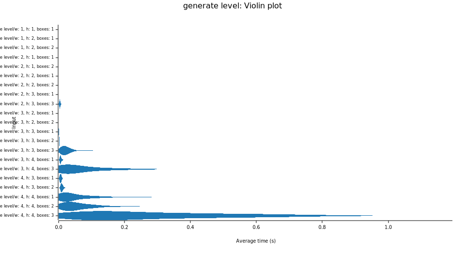

# Sokoban Level Generator in Rust

This is a sokoban level generator algorithm written in rust to procedurally
generate levels for the game [Sokoban](https://en.wikipedia.org/wiki/Sokoban).

The algorithm is based on the following resources:

- [Procedural Generation of Sokoban Levels](http://ianparberry.com/techreports/LARC-2011-01.pdf);
  a technical report by Joshua Taylor and Ian Parberry.
- [Sokoban-Level-Generator](https://github.com/AlliBalliBaba/Sokoban-Level-Generator);
  a javascript implementation by AlliBalliBaba.

## Usage

In order to use the generator, add this library (via git) to your project
with cargo. Then, import the level generator and use it to generate
a level. The ``level_to_string`` method allows you to print the level
in the [JSoko Level Format](https://www.sokoban-online.de/sokoban/levell-format/).

```rust
use sokoban_level_generator::{generate_level, level_to_string};

fn main() {
    let level = generate_level(4, 4, 3);
    println!("Print level");
    println!("{}", level_to_string(&level));
}
```

The algorithm uses randomness to generate levels and needs
to create the "farthest state possible" for boxes. As such,
generation with more boxes can take a very long time. See the
benchmarks section for more information.

**Warning**: Currently, there is no abort limit. So, trying to
generate impossible levels (e.g. 1x1 with 4 boxes) will result
in an infinite loop.

## Algorithm

The algorithm performs the following (high-level) steps:

1. Generate an empty level with ``width * 3`` and ``height * 3`` dimensions, since every "room" is 3x3.
2. Generate rooms in the level (by using the described templates in the paper); rooms are randomly selected and rotated
3. After the level is generated, check the level for:
    - Enough space
    - Enough goal possibilities (to place goals)
    - No large spaces (this does not generate interesting levels)
    - All floors are connected
    - No surrounded floors
4. Generate random goal locations
5. Calculate the "farthest state possible" for each box/player position
6. Return the farthest possible level

## Benchmarks

Benchmarks show that the algorithm is very fast for small levels, but
can take a very long time for larger levels. The biggest impact on
generation time is the number of boxes.

The result in short: feasible, interesting levels can be generated with
up to 4 boxes in a reasonable amount of time. The height / width of the
level should be kept below or equal to 3. If 3 or fewer boxes are used,
the level can be up to 4x4 in size. Bigger sizes must be experimented with.

The following tables shows the generation time for different level sizes.

### 1 Box
| Width | Height | Median Time |
|-------|--------|-------------|
| 1     | 1      | 5.7706 µs   |
| 1     | 2      | 19.403 µs   |
| 2     | 2      | 84.277 µs   |
| 2     | 3      | 4.3456 ms   |
| 3     | 3      | 1.3252 ms   |
| 3     | 4      | 6.3146 ms   |
| 4     | 4      | 33.759 ms   |

### 2 Boxes
| Width | Height | Median Time |
|-------|--------|-------------|
| 1     | 2      | 36.320 µs   |
| 2     | 2      | 241.53 ms   |
| 3     | 2      | 798.81 µs   |
| 3     | 3      | 2.9076 ms   |
| 4     | 3      | 10.201 ms   |
| 4     | 4      | 42.901 ms   |

### 3 Boxes
| Width | Height | Median Time |
|-------|--------|-------------|
| 2     | 3      | 4.3456 ms   |
| 3     | 3      | 20.324 ms   |
| 3     | 4      | 50.916 ms   |
| 4     | 4      | 227.51 ms   |

### Violin Plot (1-3 Boxes)



As we can see in the violin plot, the number of boxes has a huge impact on the generation time.
